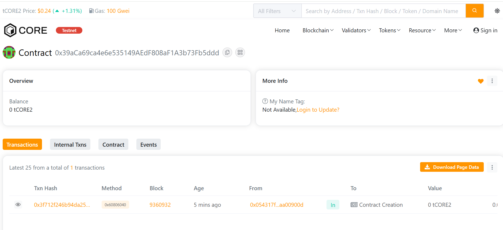

# MetaVault Protocol

## 🧩 Project Description
**MetaVault Protocol** is a decentralized Ethereum-based vault system that allows users to securely **deposit**, **withdraw**, and **track** their crypto holdings on-chain. The project demonstrates fundamental smart contract interactions using Solidity and Hardhat.

---

## 🎯 Project Vision
To build a transparent, decentralized, and user-friendly **vault ecosystem** that provides secure asset storage and easy fund management for DeFi users worldwide.

---

## ✨ Key Features
- **Deposit & Withdraw:** Users can deposit ETH and withdraw at any time.
- **Balance Tracking:** Every user’s funds are securely tracked on-chain.
- **Event Logs:** Deposits and withdrawals are logged for transparency.
- **Ownership:** Contract ownership is assigned to the deployer.

---

## 🔮 Future Scope
- Add **ERC20 token** deposit support.
- Integrate with **DeFi yield farming protocols**.
- Implement **multi-signature withdrawals** for enhanced security.
- Develop a **frontend dashboard** for user-friendly interactions.

---

## 🧠 Setup Instructions

Address: 0x054317f26cf1974e6e579fbf9358bffdaa00900d

